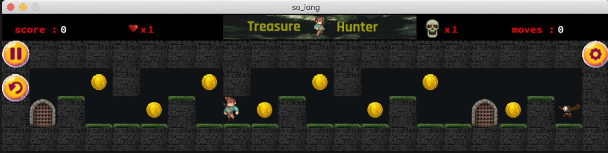

<h1 align="center">
	42 - so_long
</h1>

<p align="center">
	<b><i>project form 42cursus project at 1337</i></b><br>
</p>

<p align="center">
	
	
	
	
	
</p>





# Description :
a graphic project from 42 network , this project works only on macOS because of the library (mlx.h) that i used , and you need to set up this library first on your mac (GO TO 42 DOC).

# Preview :

https://user-images.githubusercontent.com/84334734/152559975-f67e5364-89a6-4975-8e58-c1b195f0734a.mp4


## How to run so_long

```bash
git clone git@github.com:ael-bekk/so_long.git
cd so_long
make
./so_long [path to the map.ber]
"[path to the map.ber] : (for example : maps/map.ber or any map from the maps dir or you can just create your own map)"
```

## HOW TO PLAY
The player’s goal is to collect all collectibles present on the map then escape with minimal movement.

|KEYBOARD|ACTION|
|---|---|
|`W`, `↑`|Move up|
|`S`, `↓`|Move down|
|`A`, `←`|Move left|
|`D`, `→`|Move right|
|`return ⏎`| Start game|
|`click on th restart icon`|Retry game|
|`click on th pause icon`|pause game|
|`click on th setting icon and choose what you want`|change the keys from the setting icon|
|`ESC ⎋`|Close the game window|
|`ESP `|attack on enemys|
